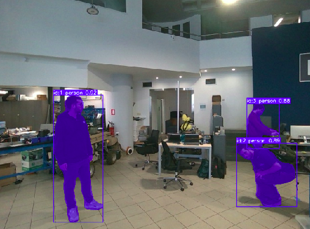
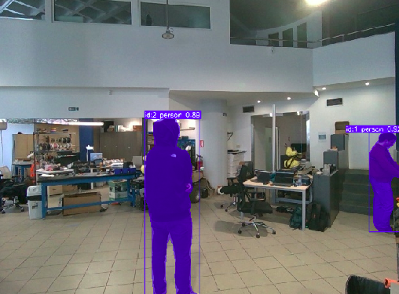
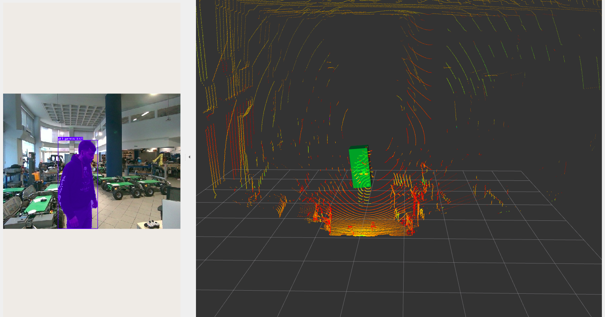

# human_detection_fusion — Human Detection & Tracking for Mobile Robots (ARISE-KIRO)


`human_detection_fusion` is the **Human Detection and Tracking** reusable module of the **KIRO**
experiment (ARISE 1st Open Call). It packages the human detection and tracking stack of the KIRO
TRL6-7 demonstrator — tested at IKH's warehouse premises — as a standalone Docker container with a
documented, source-agnostic ROS 2 interface. The module fuses YOLO-based visual detections (from a
RealSense D455 camera + Bpearl LiDAR point cloud) with UWB worker identity data, assigns person
identities via nearest-neighbour association, and publishes per-person 3-D positions in the
[ROS4HRI](https://wiki.ros.org/hri) (`hri_msgs`) format.

- **Inputs:** `/camera/camera/color/image_raw[/compressed]`, `/camera/camera/color/camera_info`,
  `/bpearl_lidar/points` — vision and depth sensors; `uwb/worker1`, `uwb/worker2` (+ `_name_tag`
  variants) — UWB worker positions arriving from FIWARE NGSI-LD Worker entities via the
  DDS↔NGSI-LD enabler.
- **Outputs:** `/humans/persons/tracked` (`hri_msgs/IdsList`),
  `/humans/persons/<id>/position` (`hri_msgs/PointOfInterest3DStamped`).
- **Capability delivered:** real-time person detection, 3-D localisation, and worker identity
  fusion — producing per-person positions in the ROS4HRI format consumed by social navigation
  planners (e.g. `kiro_nav`'s CoHAN-Nav2/HATeb).

> **New here?** Read this README top-to-bottom, then the detailed pages under
> [`docs/`](docs/). The quickest check that everything installed is the
> [hello world](#quick-start) (no robot needed); to see the full pipeline running against
> simulated sensors, run the [demo](#demo).

---

## Connection with ARISE

This module is the open implementation of the human detection capability in the KIRO TRL6-7
demonstrator. Whenever the robot is navigating or executing a delivery task, the social planner
(`kiro_nav`) requires up-to-date person positions — these come exclusively from this module.

- **ROS 2 / Vulcanexus:** the module runs on **Vulcanexus Humble** and exposes its capability
  purely over standard ROS 2 interfaces (ROS4HRI topics over Fast DDS). See
  [`docs/02_interfaces.md`](docs/02_interfaces.md).
- **ROS4HRI / ROS4RI:** ✅ applied. The module is the **upstream producer** of the ROS4HRI
  person-position interface. It publishes `hri_msgs/IdsList` on `/humans/persons/tracked` and
  `hri_msgs/PointOfInterest3DStamped` per person, consumed directly by `kiro_nav` without any
  custom bridging on the consumer side. See [`docs/02_interfaces.md`](docs/02_interfaces.md#ros4hri--ros4ri-alignment).
- **FIWARE / NGSI-LD, DDS enabler:** ✅ applied for UWB inputs. Worker positions
  (`uwb/worker1`, `uwb/worker2`) and identity tags (`uwb/worker*_name_tag`) arrive from
  FIWARE NGSI-LD `Worker` entities (`urn:ngsi-ld:Worker:EMP-1`, `EMP-2`) via the eProsima
  DDS↔NGSI-LD enabler. The enabler bridges `Worker.mapPosition` and `Worker.nameTag` attributes
  as DDS topics (`rt/uwb/worker1`, etc.), which ROS 2 receives natively. See
  [`docs/02_interfaces.md`](docs/02_interfaces.md#fiware--ngsi-ld--dds-enabler).

This work is part of KIRO, co-funded by the European Union under the Horizon Europe **ARISE**
project (Grant Agreement No. 101135784).

---

## Architecture

```
┌───────────────────────────────────────────────────────────────────────┐
│  human_detection_fusion container                                     │
│                                                                       │
│  ┌───────────────────────────────────────────────────────────────┐    │
│  │  ultralytics_ros tracker_with_cloud                           │    │
│  │    tracker_node.py          → /yolo_result, /yolo_image       │    │
│  │    tracker_with_cloud_node  → /yolo_3d_result                 │    │
│  │                               /detection_marker (MarkerArray) │    │ 
│  └────────────────────────┬──────────────────────────────────────┘    │
│                           │ /yolo_3d_result                           │
│  ┌────────────────────────▼──────────────────────────────────────┐    │
│  │  yolo_uwb_fusion_node (C++)                                   │    │
│  │    fuses 3-D detections with UWB worker positions             │    │
│  │    → /humans/persons/tracked  (hri_msgs/IdsList)              │    │
│  │    → /humans/persons/<id>/position  (PointOfInterest3DStamped)│    │
│  └───────────────────────────────────────────────────────────────┘    │
│                                                                       │
│  External inputs (--network host, same DDS domain):                   │
│    /camera/camera/color/image_raw[/compressed]                        │
│    /camera/camera/color/camera_info                                   │
│    /bpearl_lidar/points            (sensor_msgs/PointCloud2)          │
│    uwb/worker1, uwb/worker2        ← FIWARE Worker.mapPosition        │
│    uwb/worker1_name_tag, uwb/worker2_name_tag  ← FIWARE Worker.nameTag│
│                                                                       │
│  Works with real hardware (IKH production) or Gazebo simulation.      │
└───────────────────────────────────────────────────────────────────────┘
```

---

## Quick start

```bash
chmod +x run.sh
./run.sh --shell # build image + drop into bash (no hardware needed)
```

See [`docs/03_installation_and_hello_world.md`](docs/03_installation_and_hello_world.md) for detailed
installation steps.

## Demo

```bash
# Requires pmb2_hunav_simulation as a sibling directory, kiro_sensors branch

# 1. Clone the repository into the parent directory
git clone https://github.com/andvatistas/pmb2_hunav_simulation.git ../pmb2_hunav_simulation

# 2. Switch to the required branch
git -C ../pmb2_hunav_simulation checkout kiro_sensors

# 3. Make the demo script executable
chmod +x examples/run_demo.sh

# 4. Run the demo
./examples/run_demo.sh
```

See [`docs/04_basic_demo_how_to_use.md`](docs/04_basic_demo_how_to_use.md) and
[`examples/run_demo.md`](examples/run_demo.md) for the full walkthrough.

---

## Repository layout

```
human_detection_fusion/
├── config/
│   └── detection_params.yaml               # Tunable parameters (volume-mounted)
├── docker/
│   ├── Dockerfile                          # Image: Vulcanexus + ultralytics + hri_msgs + this package
│   ├── entrypoint.sh                       # Sources workspaces, exec "$@"
│   └── docker-compose.yml                  # Compose equivalent of run.sh
├── docs/
│   ├── 01_arise_context.md                 # ARISE framing, target platforms, missions, ROS4HRI
│   ├── 02_interfaces.md                    # ROS 2 / DDS / FIWARE / ROS4HRI interface tables
│   ├── 03_installation_and_hello_world.md  # Documentation for installation and hello world
│   ├── 04_basic_demo_how_to_use.md         # Documentation for basic demo 
│   └── 05_role_in_demonstrator.md          # Role in the TRL 6-7 Demonstrator
├── examples/
│   ├── run_demo.sh                         # One-command two-container simulation demo
│   └── run_demo.md                         # Step-by-step manual walkthrough
├── include/human_detection_fusion/
│   ├── yolo_uwb_fusion_node.hpp            # Node class declaration
│   └── fusion_utils.hpp                    # UWBWorker struct + distance utility
├── launch/
│   ├── human_detection.launch.py           # Main launch file (volume-mounted)
│   └── launch.sh
├── media/
│   ├── architecture_diagram.md             # Architecture & Sequence diagrams
│   └── video.md                            # Link to demonstrator video
├── rviz/
│   └── human_detection.rviz                # RViz2 config: Bpearl points + markers + YOLO image
├── src/
│   └── yolo_uwb_fusion_node.cpp            # Fusion node: YOLO 3-D + UWB → hri_msgs
├── .dockerignore
├── .gitignore
├── CMakeLists.txt                          # Build configuration
├── LICENSE                                 # License information
├── package.xml                             # Package metadata and dependencies
├── README.md                               # Overview of the ARISE KIRO specific package
└── run.sh                                  # Build + launch entry point (--sim, --rviz, --no-build, --shell)
```

---

## System Validation Screenshots

From the IKH warehouse, where the demonstrator tests where conducted:

<table>
  <tr>
    <td></td>
    <td></td>
  </tr>
  <tr>
    <td align="center"><b>Figure 1:</b> Multiple human tracking even during a squatting posture</td>
    <td align="center"><b>Figure 2:</b> Robust tracking even when the subject is turned away</td>
  </tr>
</table>

<div align="center">
  
  <br />
  <p><b>Figure 3:</b> Real-time 3D bounding box projection and point cloud alignment within the RViz environment. Camera and Lidar association for precise human tracking and 3d pose estimation.</p>
</div>

---

## Known limitations

- **Two UWB workers hardcoded**: the node subscribes to `uwb/worker1` and `uwb/worker2` only. Adding more workers requires extending `setup_uwb_subscribers()` in `src/yolo_uwb_fusion_node.cpp`.
- **No velocity estimation**: the node publishes 3-D position per person but not velocity. Downstream planners that require velocity (e.g. CoHAN-Nav2/HATeb in `kiro_nav`) use a separate velocity estimator node.

## Maintainer, contact & citation

- **Maintainers:** Andreas Vatistas, Nikolaos Lappas
- **Project contacts (IKNOWHOW SA):** Maria Kampa <mkampa@iknowhow.com>.
- **Acknowledgement:** developed in the KIRO experiment, co-funded by the European Union under the Horizon Europe ARISE project (GA 101135784).

## License

AGPL-3.0 License — see [LICENSE](LICENSE).

**Copyright owner:** ATHENA RC (KIRO partner), on behalf of the KIRO experiment within the ARISE
project (Horizon Europe GA 101135784).

**Third-party licenses:**

| Dependency | License |
|---|---|
| [ultralytics_ros](https://github.com/nikolaslps/ultralytics_ros) | AGPL-3.0 |
| [ultralytics (YOLOv8)](https://github.com/ultralytics/ultralytics) | AGPL-3.0 |
| [hri_msgs](https://github.com/andvatistas/hri_msgs) | Apache-2.0 |
| [Intel RealSense SDK / ROS 2 wrapper](https://github.com/IntelRealSense/realsense-ros) | Apache-2.0 |
| [HuNavSim](https://github.com/robotics-upo/hunav_sim) (examples only) | MIT |
