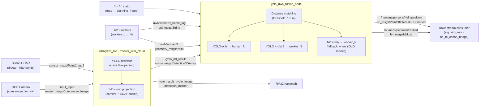
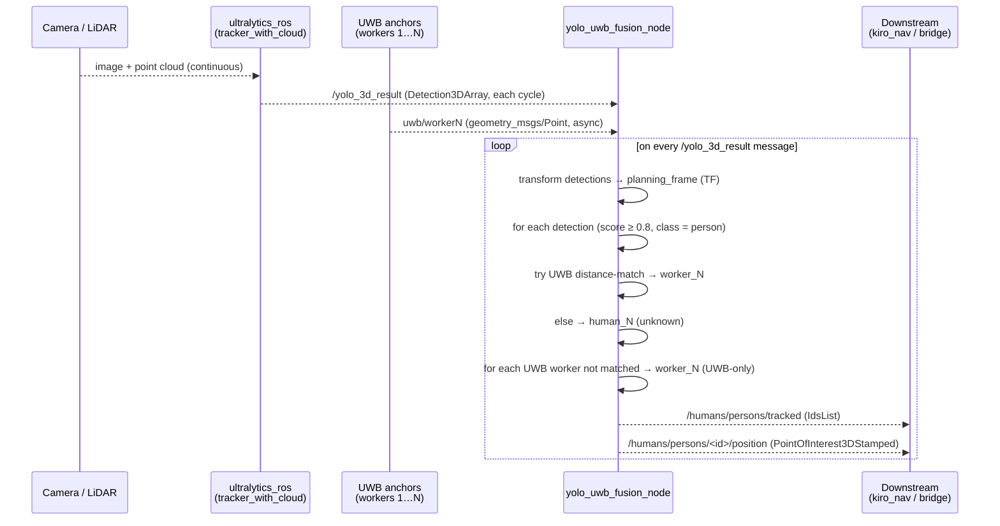

# human_detection_fusion — Architecture & data flow

## Component / data-flow diagram

How `human_detection_fusion` sits between the robot's sensors and a downstream consumer (e.g. `kiro_nav`).

Key tuning knobs (hardcoded constants in the node):
- **SCORE_THRESHOLD** `0.8` — minimum YOLO detection confidence to consider.
- **FUSION_DISTANCE** `1.0 m` — max distance between a YOLO bbox centre and a UWB position to call them the same person.

---

## Sequence — one detection cycle

